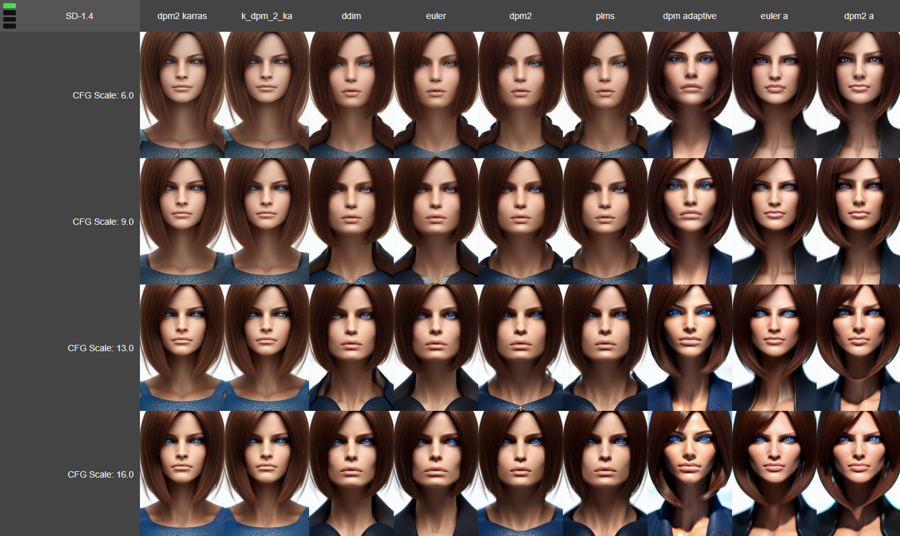
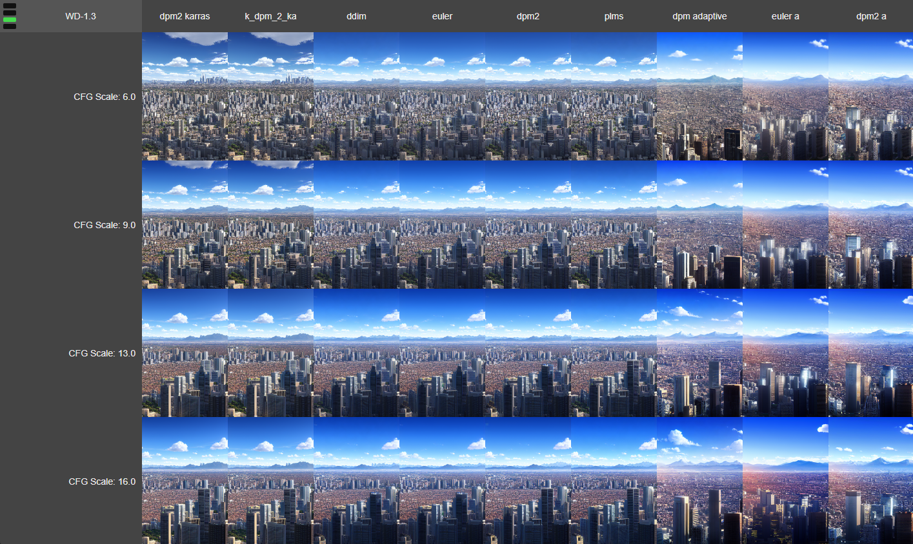

# xyz_plot_script

XYZ Plot Script for Stable Diffusion WebUI. Because 3D is better than 2D! 😎

Adapted and modified from the original X/Y Plot script that's part of [AUTOMATIC1111's Stable Diffusion WebUI](https://github.com/AUTOMATIC1111/stable-diffusion-webui) repo.

Thanks to AUTOMATIC1111 for making such a kick-ass web UI for the community.

See example screenshots below!

## ⬇️ Installation

Download `xyz_grid.py` and `xyz_grid.template.html` and place it in the `/scripts/` folder of your SD WebUI install.

Push the "Reload Scripts" button at the bottom of the Settings tab.

## 🖱️ Usage

Emits a folder to your samples output directory containing all of the necessary images, as well as an .html viewer file, and a .js file for metadata.

Example path would be `[your samples dir]/xyz/00001/`. Inside would be `index.html`, `data.js`, and an `/images/` directory containing all of your images.

After generation is complete, simply open `index.html` in your favorite modern browser.

### 🌐 Browsing

The displayed grid represents the X/Y plots. Scroll or use the arrow or PgUp/PgDown keys to navigate the Z axis. (The label and the bars in the upper left corner denote the Z value you are viewing. Scrolling will cycle through each Z value.)

### 🔎 Image Viewing / Metadata

Left-click on any image to open it in a new tab (for direct viewing, copying, etc).

Right-click on any image to copy the full info prompt to your clipboard (so you can paste it into the WebUI and recreate the image).

## ❔ FAQ

* **Will this save X/Y grid images like the standard X/Y Plot does?**
  * No.
* **Does this also write the default image file using my filename template to the Samples output directory?**
  * No, the images are only located in the `/xyz/` folder, and they are named specifically so that the web viewer can read and display them properly.
* **What order does the script process the dimensions in?**
  * Z, Y, X. (If you have Checkpoint as a dimension, place it on Z or Y, not X.)
* **Can I use this on Colab?**
  * I have no idea. Good luck!
* **How come you used background images instead of `` tags?**
  * CSS is hard, okay?
* **Why did you use Vue.js?**
  * Because it makes it easier to bind and display a large dataset like a 3-dimensional grid of images.
* **I don't want it loading Vue.js from a CDN. Can I make this script work offline?**
  * Sure. Download [Vue.js 2.7.13 (production, full, global)](https://cdnjs.cloudflare.com/ajax/libs/vue/2.7.13/vue.min.js) and place it in your `/scripts/` folder, then change the CDN link in the HTML template file to ``.
* **Is there a limit to how many choices you can display on a given axis?**
  * For the Z axis, the pager display (the little green light thing) will start to get messed up if you have more than 6 or 7 plots. For X and Y... how many images can your computer/browser handle? :)
* **Can you make the webpage do [X]?**
  * Sure, if you send me a pull request!

## 🖼️ Screenshots

